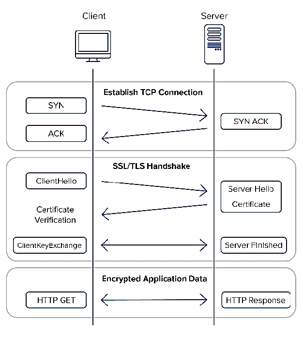

# Introduction to Secure Communication
## Protecting Data in Transit

* Introduction to encryption and digital certificates
* Generating public and private keys
* Encrypting and decrypting data using OpenSSL
* Securing web communications with SSL/TLS

by: Mr.Mohammad Al-aqua

---

# What is Encryption?

- **Definition**: The process of converting plaintext data into unreadable ciphertext to protect it from unauthorized access
- **Types of encryption**: 
  - Symmetric encryption (e.g., AES)
  - Asymmetric encryption (e.g., RSA)

---

# What is OpenSSL?

- **Definition**: A software library for encryption, decryption, and other cryptographic operations using the Secure Sockets Layer (SSL) and Transport Layer Security (TLS) protocols.
- **Features**: 
  - Generating public and private keys
  - Encrypting and decrypting data
  - Creating digital certificates
  - Supporting various encryption algorithms

---

# Digital Certificates

- **Definition**: A digital certificate is a file that contains a public key and identity information about the owner of the key.
- **Types of digital certificates**:
  - Self-signed certificates
  - CA-signed certificates

---

# Securing Web Communications with SSL/TLS

- **Definition**: SSL/TLS is a protocol for encrypting web communications between a client and a server
- **How it works**:
  1. The client initiates a connection to the server
  2. The server responds with its digital certificate
  3. The client verifies the certificate and establishes an encrypted connection

---

---

# SSH (Secure Shell)

- **Definition**: SSH is a protocol for secure remote access to a computer or network
- **Features**: 
  - Encryption of data in transit
  - Authentication using passwords or public keys
  - Secure file transfer

---

# Mitigating Common SSH Vulnerabilities

- **Common vulnerabilities**: 
  - Weak passwords
  - Unrestricted access
  - Outdated software

- **Best practices**: 
  - Use strong passwords and public key authentication
  - Restrict access to authorized users and groups
  - Keep software up to date

---

# Conclusion

- **Summary**: Secure communication is essential for protecting data in transit

- **Key takeaways:**
  - Encryption and digital certificates are crucial for secure communication
  - OpenSSL and SSH are important tools for secure communication
  - Best practices for secure communication include using strong passwords, restricting access, and keeping software up to date

---

# <!--fit-->Q&A